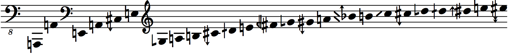
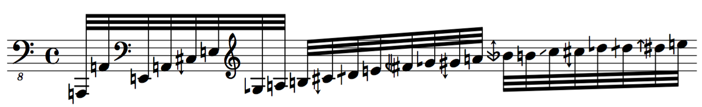
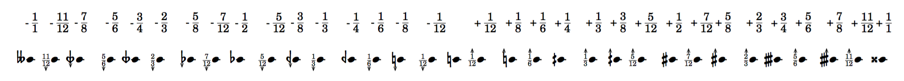
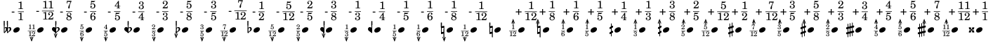

# abjad-ext-microtones
Microtonal Abjad Extension Package  
  
  

This package currently requires installation of the `ekmelos` or `HEJI2` font into lilypond  

* the fonts can be found at http://www.ekmelic-music.org/en/extra/ekmelos.htm and http://www.plainsound.org/ respectively.  

For the display of accidentals, `\accidentalStyle dodecaphonic` must be set in the `layout` block and an `\include` for the path to `ekmelos-accidental-markups.ily` or `heji2-accidental-markups.ily` within this package must be added.  

Currently supports Helmholtz-Ellis Just Intonation accidentals:  

ekmelos  
  

HEJI2  
  

Default EDO accidentals:  

  

Ekmelos EDO accidentals:  

  

---
Conceivably, the accidental notation is personalizable by user-defined stylesheets similar to the ones included with this package.
---
Dev branch features pitch and interval utilities.
