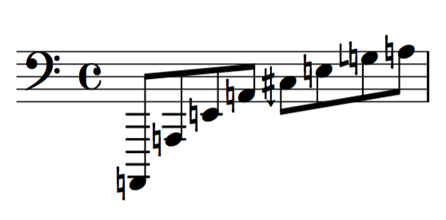

# abjad-ext-microtones
Microtonal Abjad Extension Package  

This package currently requires installation of the ekmelos font into lilypond  
*Does not yet support retuning of chords.*  
&nbsp;&nbsp;&nbsp;&nbsp;the font can be found at http://www.ekmelic-music.org/en/extra/ekmelos.htm  
For the display of accidentals, `\accidentalStyle dodecaphonic` must be set in the `layout` block and an `\include` for the path to `heji-accidental-markups.ily` within this package must be added.  

