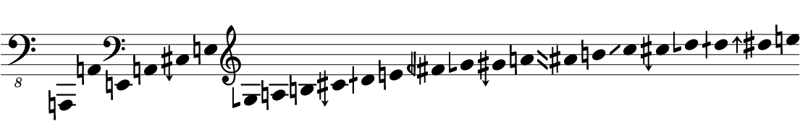
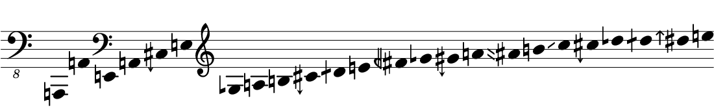

# abjad-ext-microtones
Microtonal Abjad Extension Package  

This package currently requires installation of the ekmelos or HEJI2 font into lilypond  
* the fonts can be found at http://www.ekmelic-music.org/en/extra/ekmelos.htm and http://www.plainsound.org/ respectively.  
For the display of accidentals, `\accidentalStyle dodecaphonic` must be set in the `layout` block and an `\include` for the path to `ekmelos-accidental-markups.ily` or `heji2-accidental-markups.ily` within this package must be added.  
  
  
